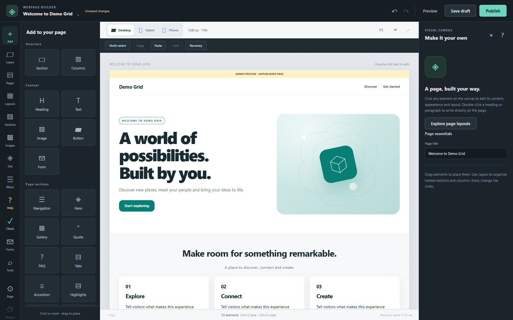
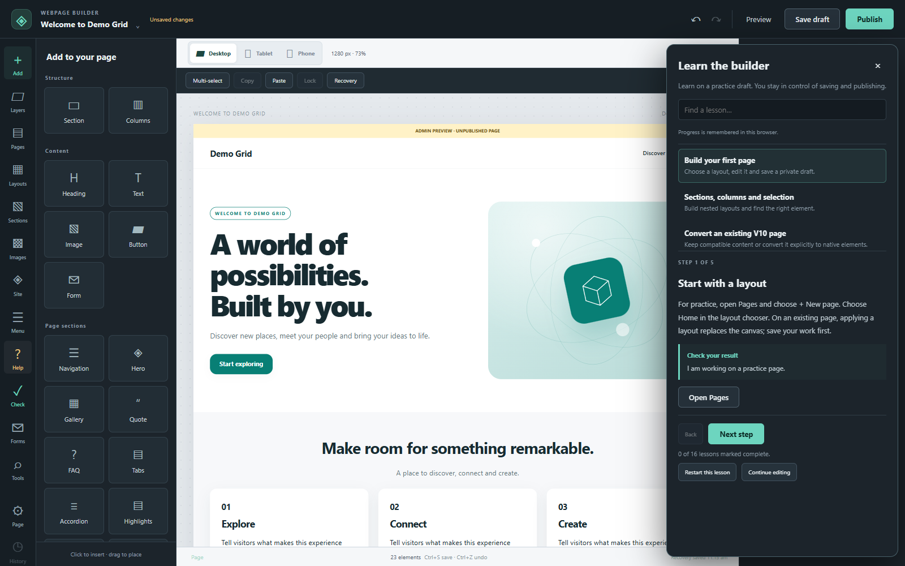

# DreamGrid Website

A portable website add-on for an existing, configured Windows DreamGrid installation, with a visual Page Designer, Control Center and User Dashboard.

**Required before installation: ASCII Windows path · DIVA OFF · OTHER enabled · Folder = Other.**

Install and configure DreamGrid and your regions first. This package adapts to that installation; it does not install DreamGrid or replace grid/region data.

## Download and install

- [Download v1.0.0 portable ZIP](https://github.com/Sharpened-Razor/dreamgrid-website/releases/download/v1.0.0/DreamGrid-Website-Portable-20261007.zip)
- [SHA-256 checksum](https://github.com/Sharpened-Razor/dreamgrid-website/releases/download/v1.0.0/DreamGrid-Website-Portable-20261007.sha256)
- [Full installation and rollback instructions](INSTALLATION.md)
- [Required components](REQUIREMENTS.md)
- [Verification results and limits](VERIFICATION.md)
- [Download website](https://sharpened-razor.github.io/dreamgrid-website/)

In **DreamGrid > Setup > Settings > Apache Settings**, turn **DIVA OFF**, select/enable **OTHER**, and set its folder to **Other**. Save, then stop DreamGrid and Apache. The installer checks this setting and never changes it silently.

Extract the complete release ZIP, open PowerShell 7 in the extracted folder containing the scripts, and run:

```powershell
$gridRoot = Read-Host 'Existing DreamGrid data folder containing Settings.ini'
.\Test-DreamGridWebsitePrerequisites.ps1 -Root $gridRoot
.\Install-DreamGridWebsite.ps1 -Root $gridRoot
```

Start DreamGrid normally afterward. Use the release ZIP for installation; GitHub's automatic source archives are repository snapshots, not the verified installer ZIP.

## Included

- Visual page building with sections, columns, text, images, buttons and layouts.
- Device styling and visibility, layers/breadcrumbs, locks, copy/paste and recovery.
- Reusable sections, image library, templates, site styles, navigation and shared headers/footers.
- Drafts, publishing, revisions, explicit conversion of existing pages, import/export and template import.
- Forms, publishing/link checks, interactions, SEO/site tools and built-in tutorials.
- Dynamic destination discovery, prerequisite checks, per-file hashes, Desktop backups and rollback.





Screenshots show the shipped builder in an isolated demo installation. No live account, user page or installation configuration is shown.

## Path and runtime requirements

Use an **ASCII path throughout the complete Windows directory hierarchy**. Spaces and other drive letters are supported. Full Unicode paths are unsupported because the bundled legacy Perl stack failed those tests. Preserve DreamGrid's native internal folder layout.

PowerShell 7, the existing native Apache/PHP environment, native PHP 7 XML-RPC support, Perl on PATH, .NET 8 and DreamGrid's native OpenSim map dependencies are required. See [installation instructions](INSTALLATION.md) for the complete details.

When relocating DreamGrid, stop it, follow its native relocation procedure, then rerun this website installer with the new root **before starting DreamGrid** to refresh its generated startup-hook registration. Native DreamGrid still owns and regenerates Apache/PHP configuration.

## Content preservation

Saved pages, uploaded images, private content, databases, regions, inventories, credentials, certificates and native configuration are not distributed. Existing destination media is preserved. Existing pages are not automatically converted. Replaced website files are backed up with hashes and an archive manifest.

## Version and verification

First portable add-on release: **1.0.0**, verified 7 October 2026. Automated acceptance includes 1,628 builder assertions, 182 live smoke checks and seven live search checks. See [changelog](CHANGELOG.md) and [verification](VERIFICATION.md).

Rendered visual/mobile acceptance, real SMTP delivery and optional TLS remain destination checks. This is not a complete penetration test or a guarantee for every DreamGrid version.

Existing third-party components and artwork retain their respective notices and licenses. This release does not relicense third-party material. Retained legacy filenames and format/CSS identifiers are compatibility identifiers; runtime grid identity comes from the destination configuration.
